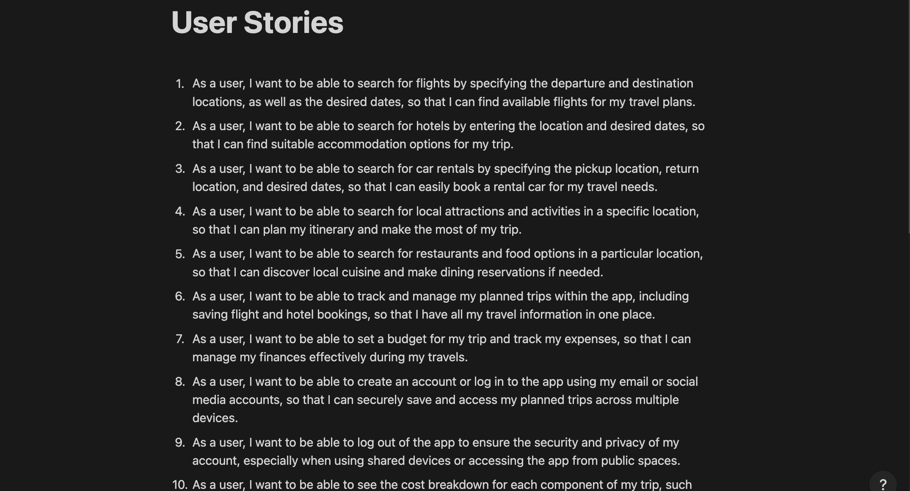
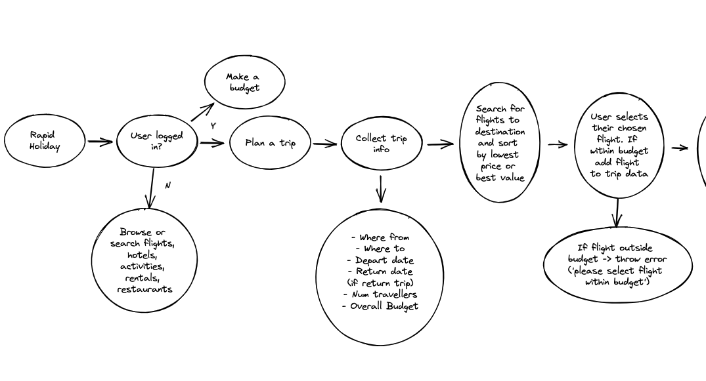
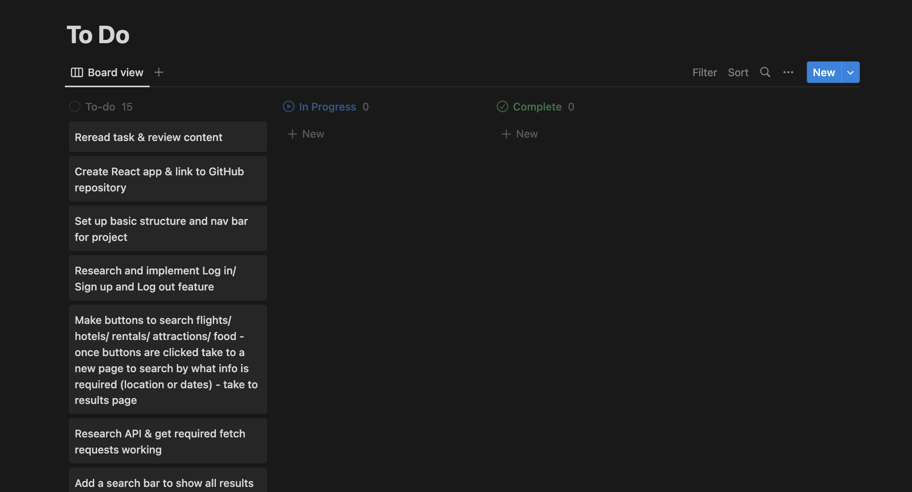

# TripWise
Welcome to TripWise, an innovative project that enables users to conveniently log in or sign up and discover attractions based on their desired location, time, and budget. With TripWise, users can effortlessly view and organise their saved trips and activities, ensuring a memorable holiday experience. If you're seeking a budget-friendly getaway packed with exciting activities, TripWise is the perfect app for you.

## :computer: [Click here](https://holiday-app.onrender.com/) to see my live project!

## :page_facing_up: About
To get started with TripWise, follow these steps:
1. Click on the link provided above.
2. Choose to sign up or log in. If you prefer to explore the app without creating an account, you can log in using the following credentials:
    - Username: 'guest'
    - Password: 'guest'

## :pencil2: Planning & Problem Solving
To ensure a well-structured development process, I followed these steps:

1. Created user stories, capturing the desired features and functionalities of a holiday planning app from a user's perspective. You can refer to the image below:

2. Developed a user flow chart to map out the app's workflow and the general process users would go through when using it. Please see the image below:

3. Designed initial website layouts through sketches to establish the app's visual structure. Here's an example:

4. Created a comprehensive to-do list, outlining the tasks and objectives that needed to be accomplished. The image below provides an overview:

## :rocket: Cool tech
TripWise incorporates the following technologies:

- HTML, CSS & JavaScript
- PostgreSQL, Node.js, Express & React
- Material UI (MUI)
- Fontjoy & Coolors

## :scream: Bugs to fix :poop:
Please be aware of the following bugs that are currently being addressed:

- Error handling needs improvement.
- The budget page is currently empty.
- CSS styling and positioning require further refinement.
- Enhancements to user flow are necessary.
- Several planned features are yet to be implemented.

## :sob: Lessons learnt
Throughout the development process, I gained valuable insights and learned important lessons, such as:

- Setting realistic expectations and avoiding scope creep.
- Taking sufficient time to understand the inner workings of each component rather than rushing for a quick setup, leading to subsequent fixes and adjustments.

## :white_check_mark: Future features
I have exciting features planned for the future of TripWise, including:

- Integrate additional MUI features to enhance the app's visual appeal.
- Enable users to edit their trip lists.
- Allow users to customise trip names according to their preferences.
- Incorporate budget management capabilities.
- Include sections for flights, hotels, car rentals, cruises, and restaurants.
- Integrate flights, hotels, and other components into the trip details.
- Save the budget alongside each trip for better financial planning and tracking during travel.
- Enable users to edit and utilise the budget while on their trip.

Thank you for your interest in TripWise! I hope you enjoy using the app and have a fantastic holiday experience.